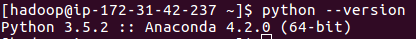

# Spark on AWS

Goals:

- Set up Spark on AWS
- Do a grid search on a RandomForest hyper-parameters to optimize the model
- Deploy the model as an API to get predictions

# Steps:

## Connecting to spark cluster 

Error:

```
aws: error: Cluster terminating or already terminated.
```

This was super confusing because it wasn't an issue with the cluster terminating. It was an access permission issue.

**Fix:** Allow my home IP to connect by updating the security settings for the cluster

Now I can ssh in:
```
aws emr ssh --cluster-id j-3QMMKQMFBB21Y --key-pair-file ~/spark-clusters.pem
```


## Installing anaconda with 'Bootstrap Actions'

**Error #1:**

```
ImportError: No module named 'sklearn'
```

~~Seems simple enough to fix: `pip install spark-sklearn`~~

~~However, pip is still defaulted to python2, so we have to reference pip-3.4.  Also, we have to do this with sudo or we get permission errors.~~

`sudo pip-3.4 install spark-sklearn`

**Error #2:**

```
ImportError: No module named 'scipy'
```

`sudo pip-3.4 install scipy`

The issue now is that if I install anything, I have to install on every box in the cluster.

**Fix:** The fix for this is to take advantage of the "Bootstrap Actions" option during setup. Doing this we can add a script that installs everything we need (aka it installs anaconda).

The following script is saved as `emr_configs.sh` and runs during

```
# ----------------------------------------------------------------------
#  move /usr/local to /mnt/usr-moved/local; else run out of space on /
# ----------------------------------------------------------------------
sudo mkdir /mnt/usr-moved
sudo mv /usr/local /mnt/usr-moved/
sudo ln -s /mnt/usr-moved/local /usr/
sudo mv /usr/share /mnt/usr-moved/
sudo ln -s /mnt/usr-moved/share /usr/

# ----------------------------------------------------------------------
#              Install Anaconda (Python 3) & Set To Default              
# ----------------------------------------------------------------------
wget https://repo.continuum.io/archive/Anaconda3-4.2.0-Linux-x86_64.sh -O ~/anaconda.sh
bash ~/anaconda.sh -b -p $HOME/anaconda
echo -e '\nexport PATH=$HOME/anaconda/bin:$PATH' >> $HOME/.bashrc && source $HOME/.bashrc

# ----------------------------------------------------------------------
#                    Install Additional Packages              
# ----------------------------------------------------------------------
conda install -y psycopg2 gensim
pip install textblob selenium
```

**Success!** - all of the nodes now have Anaconda on them



## Spark configs

Now I need the Spark config setup to point to the right python

```
[
    {
    "Classification": "spark-env",
    "Configurations": [
            {
                "Classification": "export",
                "Properties": {
                    "PYSPARK_PYTHON": "/usr/bin/python3"
                }
            }
        ]
    }
]
```

## Copy files locally

Copy python script from s3 bucket

`aws s3 cp s3://sagemaker-test-2018-09-04/iris.py iris.py`


## Submit job to cluster

`spark-submit iris.py`

## Optimize over the hyper-parameters

We are cross-validating hyper-parameters across 6 categories resulting in 216 unique possible setups for our Random Forest.

#### Hyper-parameter optimization

For each parameter in our Random Forest we are going to grid search through all of the possibilities:

```
{
    "max_depth": [3, None],
    "max_features": [1, 2, 4],
    "min_samples_leaf": [1, 3, 10],
    "bootstrap": [True, False],
    "criterion": ["gini", "entropy"],
    "n_estimators": [30, 70, 120]
}
```


#### Best hyper-parameters

```
{
    'n_estimators': 30,
    'bootstrap': True,
    'max_features': 4,
    'criterion': 'gini',
    'min_samples_leaf': 10,
    'max_depth': 3
}
```


## Saving out the model

After this is trained, we can save out the best model using sklearn's `joblib`

```
joblib.dump(gs.best_estimator_, 'iris.pkl')
```

Then we can send this to our s3 bucket:
```
$ aws s3 cp iris.pkl s3://sagemaker-2018-09-04/iris.pkl
```

## Deploying with Zappa

Zappa sets up a flask app that reads an ML model from a s3 bucket.

Now I can get scores from my model with a http POST

```
http POST https://b09cvsdjmi.execute-api.us-west-2.amazonaws.com/dev < payload.json
```

Response:

```
{1, 1}
```


# References

- [AWS spark setup guide](https://docs.aws.amazon.com/emr/latest/ReleaseGuide/emr-spark-launch.html)

- [Scikit-learn models on spark guide](https://quickbooks-engineering.intuit.com/operationalizing-scikit-learn-machine-learning-model-under-apache-spark-b009fb6b6c45)

- [Bootstrapping Cluster setup](https://dziganto.github.io/zeppelin/spark/zeppelinhub/emr/anaconda/tensorflow/shiro/s3/theano/bootstrap%20script/EMR-From-Scratch/)

- [SageMaker reference](https://docs.aws.amazon.com/sagemaker/latest/dg/how-it-works-hosting.html)

- [Serving real-time predictions on AWS EMR](https://aws.amazon.com/blogs/big-data/serving-real-time-machine-learning-predictions-on-amazon-emr/)

- [Zappa - serverless Machine Learning micro-service with AWS Lambda and AWS API Gateway](https://medium.com/@patrickmichelberger/how-to-deploy-a-serverless-machine-learning-microservice-with-aws-lambda-aws-api-gateway-and-d5b8cbead846)

